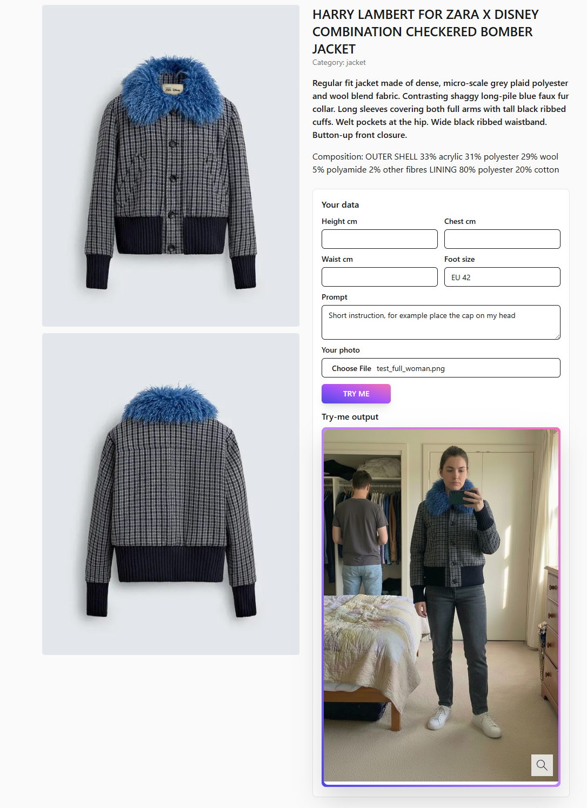
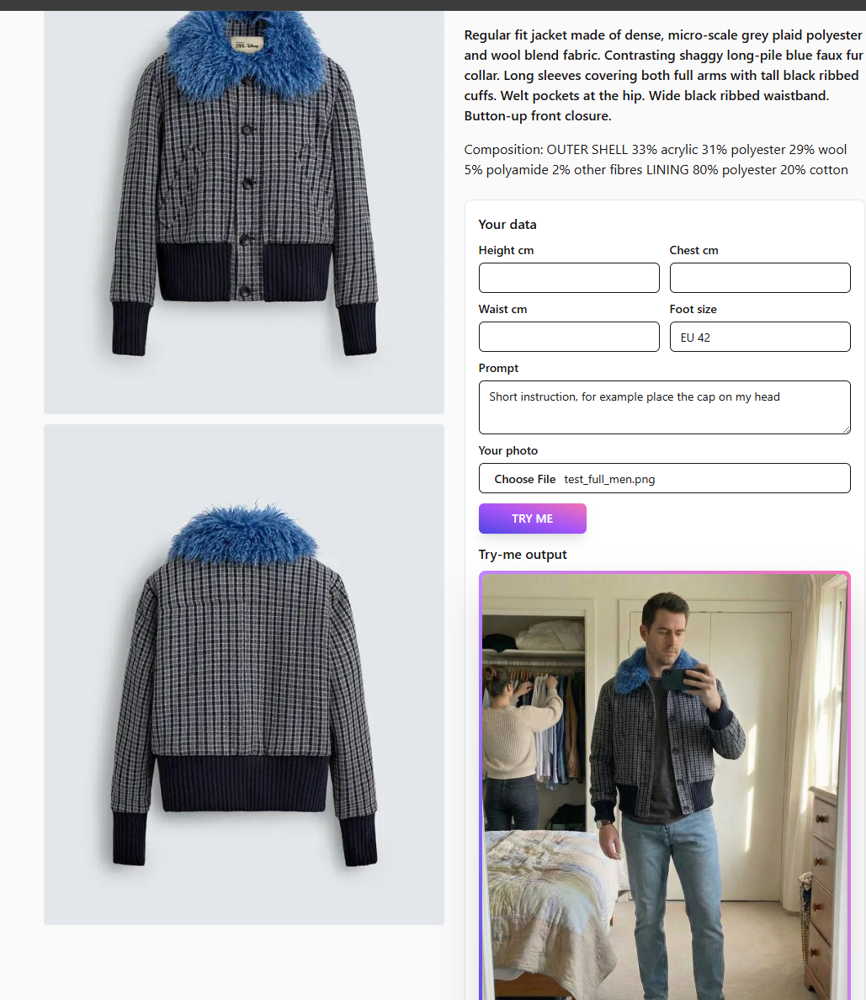
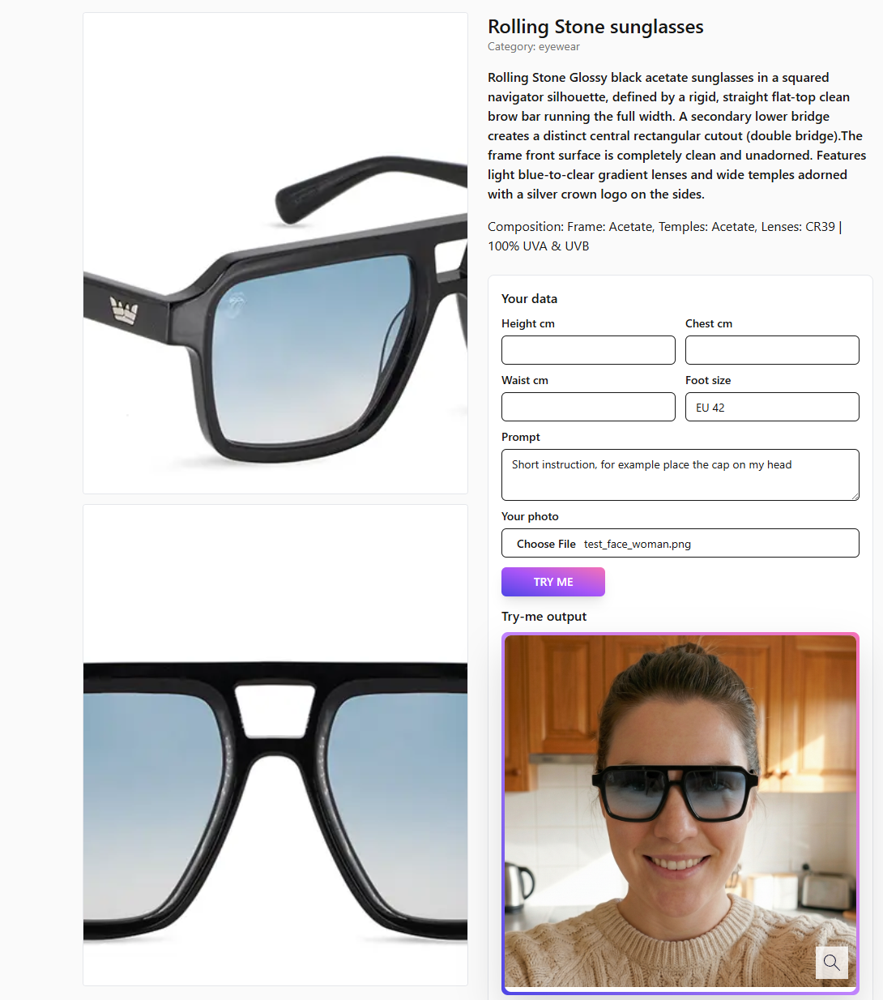
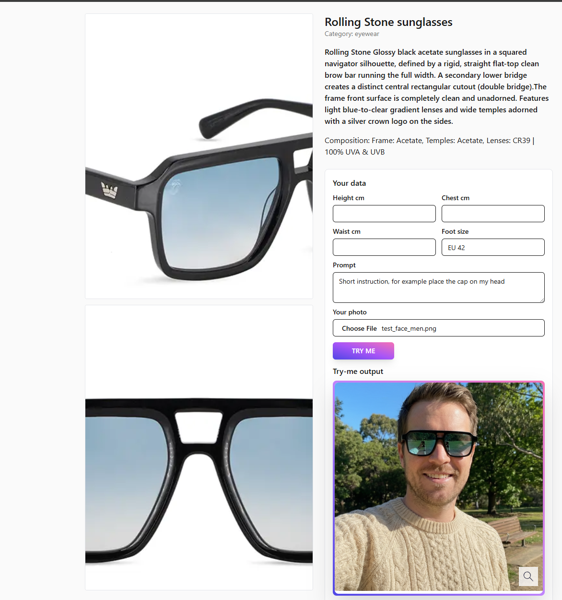
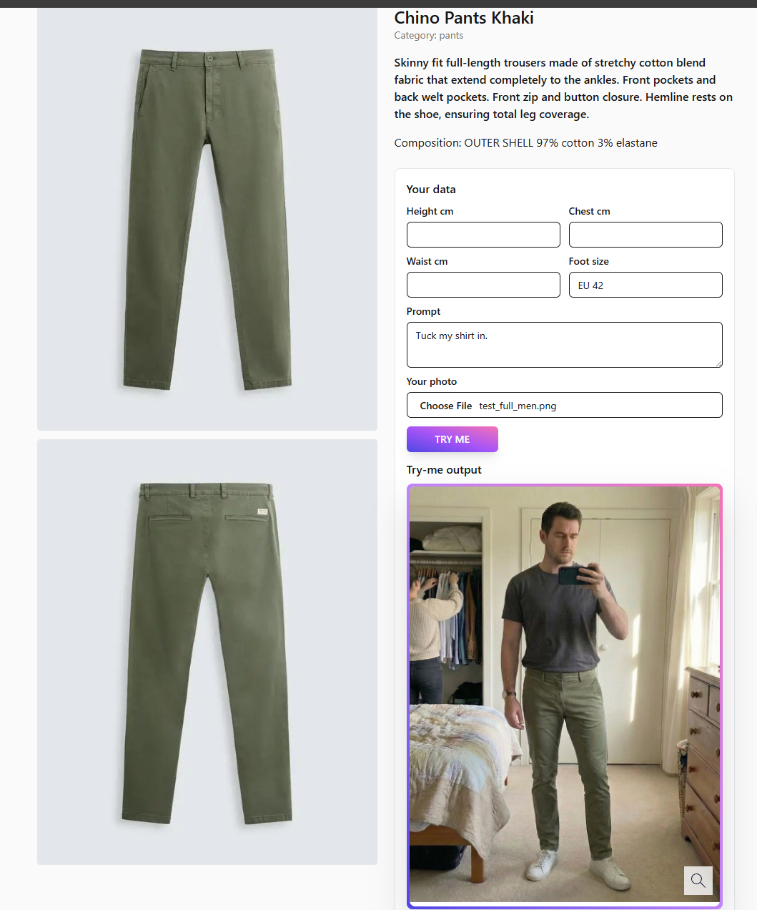
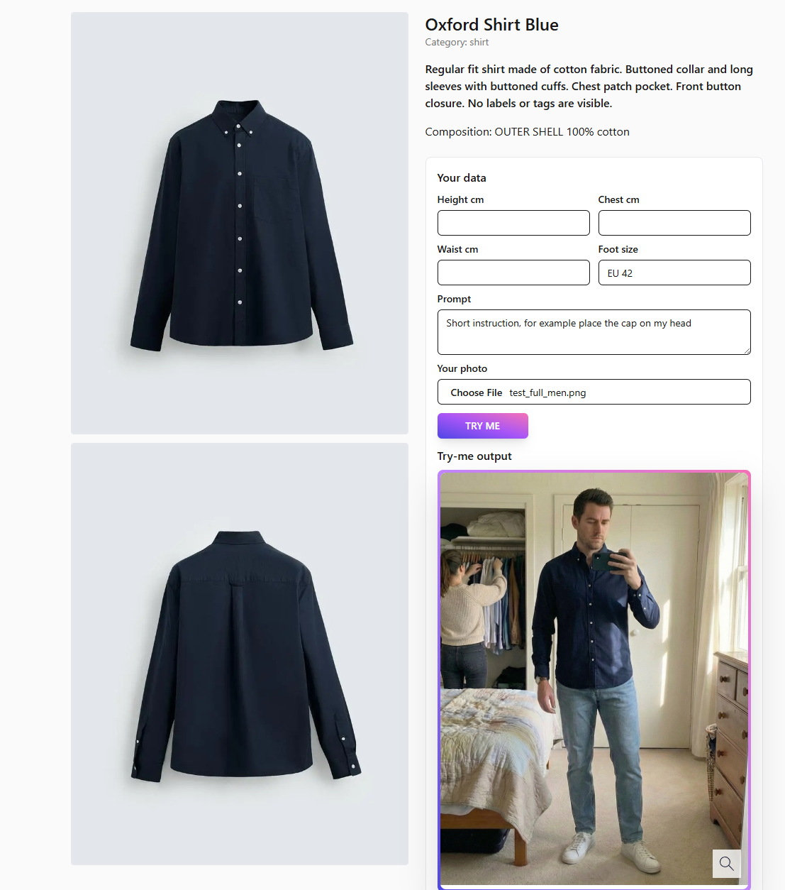
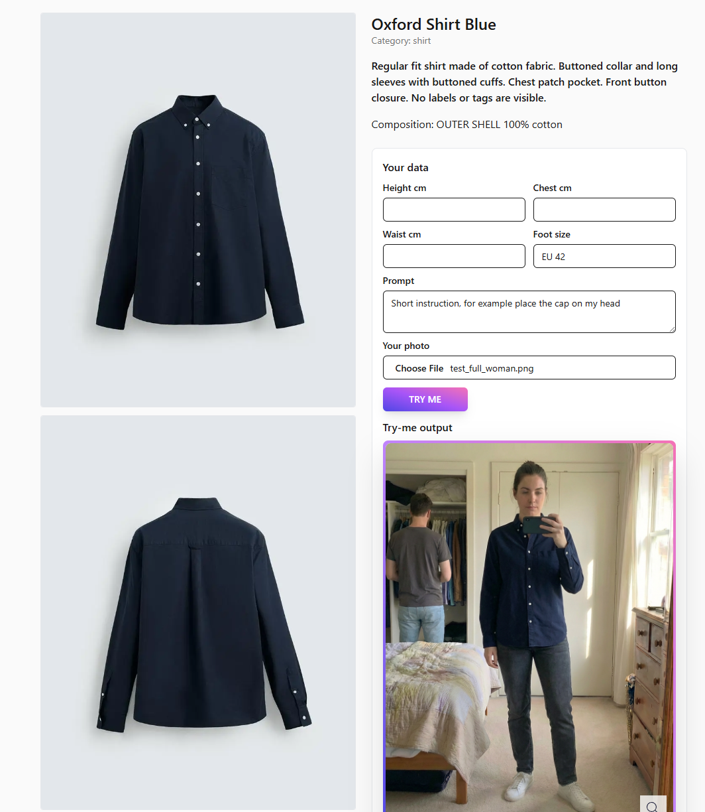
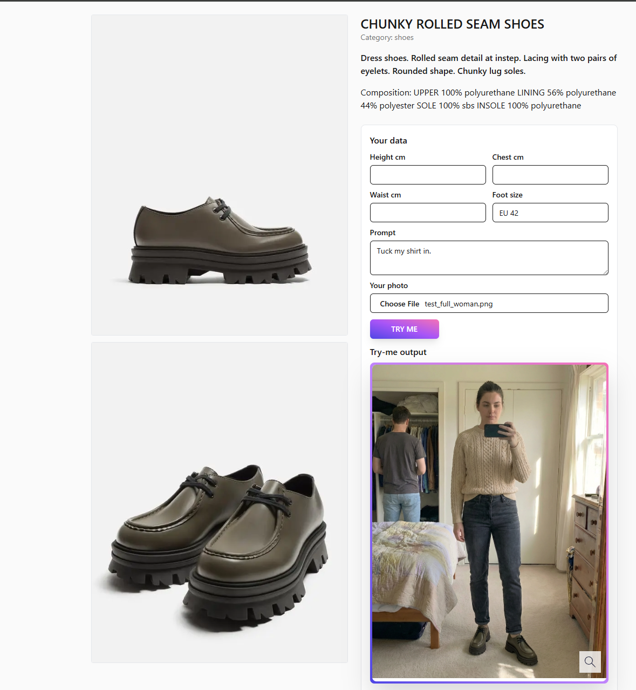
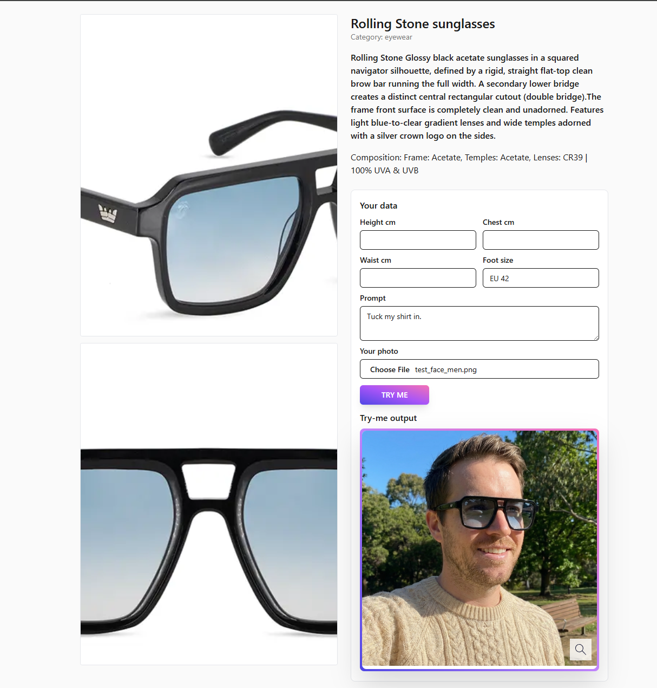
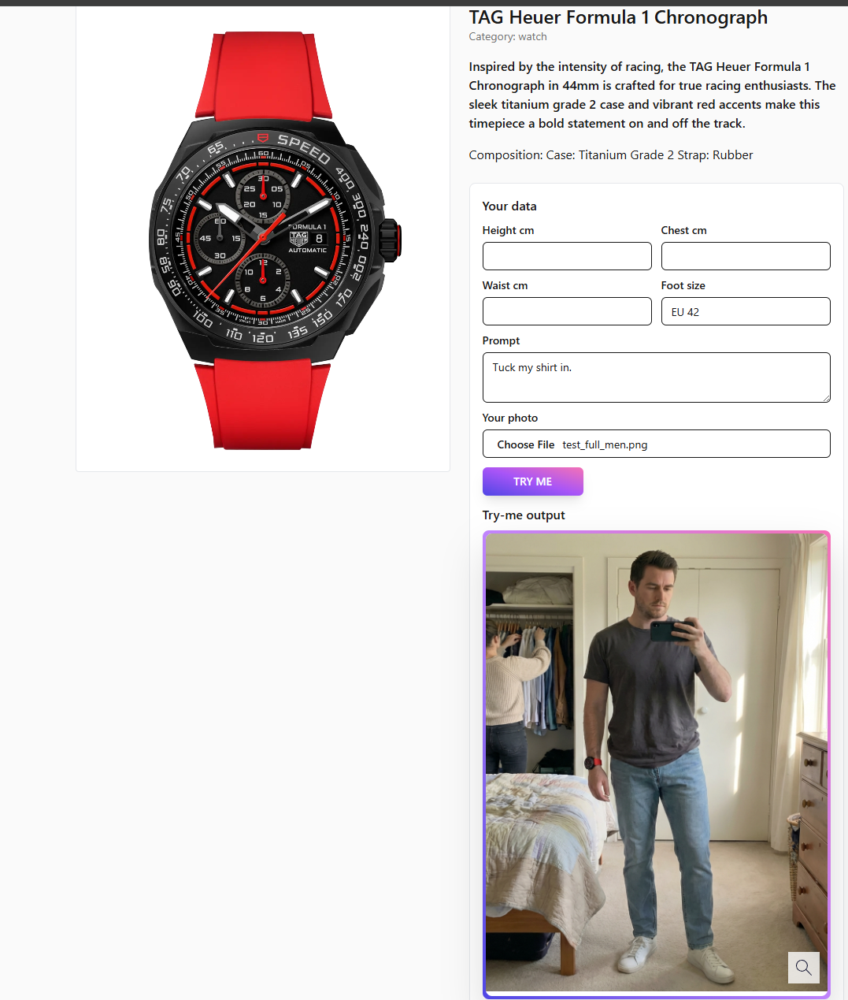

# Try-Me Implementation Examples

This document serves as a gallery for input assets and result demonstrations for the Try-Me POC.

## Testing Inputs (`examples/inputs/`)

These images are provided for developers to quickly test the application flow without needing to find or create their own testing assets.

### Men

|                   Face Only                    |                   Full Body                    |
| :--------------------------------------------: | :--------------------------------------------: |
|  |  |
|      `examples/inputs/test_face_men.png`       |      `examples/inputs/test_full_men.png`       |

### Women

|                     Face Only                      |                     Full Body                      |
| :------------------------------------------------: | :------------------------------------------------: |
|  |  |
|       `examples/inputs/test_face_woman.png`        |       `examples/inputs/test_full_woman.png`        |

## Result Showcase (`examples/results/`)

These images demonstrate the capabilities of the current AI model configuration (`gemini-3-pro-preview` / `gemini-2.5-flash-image`).

### Recent Generations

|                                                                              |                                                                                  |
| :--------------------------------------------------------------------------: | :------------------------------------------------------------------------------: |
|    `2026-01-08_15-14.png` |      `2026-01-08_16-16.png`   |
|    `2026-01-08_16-09.png` |    `2026-01-08_16-09_1.png` |
|    `2026-01-08_16-33.png` |      `2026-01-08_16-18.png`   |
|    `2026-01-08_16-19.png` |      `2026-01-08_16-29.png`   |
|    `2026-01-08_16-30.png` |      `2026-01-08_16-32.png`   |
